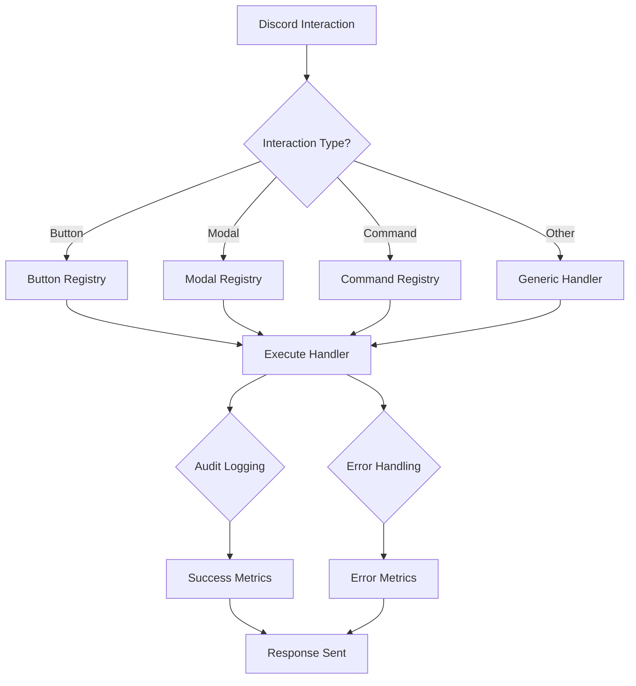

# Interaction Handlers

This directory contains the comprehensive interaction handling system for the Anti-Cheat Moderation Bot. The system provides unified routing, audit logging, error handling, and performance monitoring for all Discord interactions.

## Architecture Overview

```
handlers/
├── index.ts              # Main handler registration
├── interactionHandler.ts # Unified interaction router
├── auditMiddleware.ts    # Audit logging middleware
└── README.md            # This file
```

## Unified Interaction Handler

The `interactionHandler.ts` provides centralized routing for all Discord interactions:

### Supported Interaction Types

| Interaction Type | Handler | Description |
|------------------|---------|-------------|
| Button Clicks | `handleButtonInteraction` | Moderation action buttons |
| Modal Submissions | `handleModalSubmitInteraction` | Form responses (evidence, bans) |
| Slash Commands | `handleCommandInteraction` | User commands (/case, /mod tools) |
| Autocomplete | `handleAutocompleteInteraction` | Command suggestions |
| Context Menus | `handleContextMenuInteraction` | Right-click menus |
| Message Components | `handleMessageComponentInteraction` | Select menus, etc. |

### Interaction Flow



## Audit Middleware

The `auditMiddleware.ts` provides comprehensive audit logging:

### Audit Features

- **Interaction Lifecycle Tracking**: Start, progress, and completion
- **Performance Monitoring**: Response times and bottlenecks
- **Security Event Detection**: Suspicious activity monitoring
- **Error Correlation**: Linking errors to specific interactions
- **Compliance Logging**: Full audit trail for regulatory requirements

### Audit Context

```typescript
interface AuditContext {
  interactionId: string;    // Unique interaction identifier
  userId: string;          // Discord user ID
  startTime: number;       // Interaction start timestamp
  interactionType: string; // Type of interaction
  metadata: Record<string, any>; // Additional context
}
```

## Performance Monitoring

### Metrics Tracked

- **Total Interactions**: All processed interactions
- **Interaction Types**: Breakdown by button, modal, command, etc.
- **Error Rates**: Failed interaction percentage
- **Response Times**: Average and percentile response times
- **Handler Performance**: Individual handler execution times

### Health Checks

```typescript
const health = getInteractionHandlerHealth();
// Returns: { status: 'healthy' | 'degraded' | 'unhealthy', metrics, uptime }
```

## Error Handling

### Comprehensive Error Management

1. **Handler Errors**: Caught and logged with full context
2. **User Feedback**: Appropriate error messages sent to users
3. **Audit Logging**: All errors logged for debugging
4. **Fallback Responses**: Graceful degradation when possible
5. **Correlation IDs**: Link related errors across systems

### Error Response Strategy

```typescript
if (error.message.includes('permission')) {
  // Permission denied - clear message
} else if (error.message.includes('timeout')) {
  // Timeout - retry suggestion
} else {
  // Generic error - safe fallback
}
```

## Security Features

### Security Monitoring

- **Unauthorized Access Attempts**: Logged and flagged
- **Suspicious Patterns**: Rate limiting and anomaly detection
- **Privileged Operations**: Extra scrutiny on admin actions
- **Bot Interactions**: Special handling for automated interactions

### Security Events

```typescript
await logSecurityEvent(
  context,
  'unhandled_interaction_type',
  'Received unknown interaction type',
  AuditSeverity.WARNING
);
```

## Usage Examples

### Basic Handler Registration

```typescript
import { registerHandlers } from '../handlers';

const client = new Client({ intents: [...] });
registerHandlers(client); // Registers all interaction handlers
```

### Custom Handler with Audit Logging

```typescript
import { withAuditLogging } from '../handlers/auditMiddleware';

const auditedHandler = withAuditLogging(
  async (interaction) => {
    // Your handler logic here
    return await processInteraction(interaction);
  },
  {
    interactionType: 'custom',
    logPerformance: true,
    additionalMetadata: { customField: 'value' }
  }
);
```

### Metrics Monitoring

```typescript
import { getInteractionMetrics, getHandlerHealth } from '../handlers';

// Get current metrics
const metrics = getInteractionMetrics();
console.log(`Processed ${metrics.totalInteractions} interactions`);

// Check health status
const health = getHandlerHealth();
if (health.status === 'unhealthy') {
  // Alert administrators
}
```

## Integration Points

### Button System Integration

```typescript
// Buttons register with the button registry
import { handleButtonInteraction } from '../components/buttons';

// Automatically routed through interaction handler
// No additional setup required
```

### Command System Integration

```typescript
// Commands register with the command registry
import { handleCommandInteraction } from '../commands';

// Automatically routed through interaction handler
// Supports slash commands, autocomplete, etc.
```

### Audit Service Integration

```typescript
// All interactions automatically logged
import { createAuditLog } from '../services/auditService';

// Audit entries created for:
// - Interaction start/completion
// - Performance metrics
// - Security events
// - Errors and failures
```

## Configuration Options

### Interaction Handler Configuration

```typescript
// Environment-based configuration
const config = {
  enableAuditLogging: process.env.AUDIT_LOGGING !== 'false',
  enablePerformanceMonitoring: process.env.PERF_MONITORING === 'true',
  enableSecurityChecks: process.env.SECURITY_CHECKS !== 'false',
};
```

### Audit Middleware Options

```typescript
const auditOptions = {
  logStart: true,           // Log interaction start
  logPerformance: true,     // Log performance metrics
  additionalMetadata: {     // Extra context
    version: '2.0.0',
    environment: 'production'
  }
};
```

## Monitoring and Debugging

### Real-time Metrics

```typescript
// Monitor in real-time
setInterval(() => {
  const metrics = getInteractionMetrics();
  console.log(`Interactions/min: ${metrics.totalInteractions}`);
}, 60000);
```

### Health Endpoint

```typescript
// For external monitoring systems
app.get('/health/interactions', (req, res) => {
  const health = getInteractionHandlerHealth();
  res.json(health);
});
```

### Debug Logging

```typescript
// Enable verbose logging
process.env.DEBUG_INTERACTIONS = 'true';

// Logs include:
// - Interaction routing decisions
// - Handler execution times
// - Audit log creation
// - Error stack traces
```

## Performance Optimization

### Handler Optimization

- **Deferred Replies**: Prevent timeout for long operations
- **Efficient Routing**: O(1) lookup for registered handlers
- **Batch Operations**: Group related audit logs
- **Connection Pooling**: Reuse HTTP connections
- **Memory Management**: Clean up old interaction contexts

### Scaling Considerations

- **Horizontal Scaling**: Metrics can be aggregated across instances
- **Load Balancing**: Interaction handlers are stateless
- **Database Optimization**: Audit logs can be batched
- **Caching**: Frequently accessed data can be cached
- **Rate Limiting**: Built-in Discord rate limit handling

## Testing

### Handler Testing

```typescript
import { resetInteractionMetrics } from '../handlers';

describe('Interaction Handler', () => {
  beforeEach(() => {
    resetInteractionMetrics(); // Clean state for each test
  });

  it('should handle button interactions', async () => {
    // Test button interaction handling
  });
});
```

### Audit Testing

```typescript
import { createAuditContext } from '../handlers/auditMiddleware';

it('should create audit contexts', () => {
  const context = createAuditContext(mockInteraction);
  expect(context.interactionId).toBeDefined();
  expect(context.userId).toBe(mockInteraction.user.id);
});
```

## Future Enhancements

### Planned Features

- **Interaction Analytics**: Detailed usage analytics
- **Custom Interaction Types**: Support for new Discord features
- **Advanced Security**: ML-based anomaly detection
- **Performance Profiling**: Detailed handler profiling
- **Distributed Tracing**: Cross-service request tracing

### Extensibility

- **Custom Handlers**: Easy addition of new interaction types
- **Middleware Chain**: Pluggable middleware system
- **Handler Plugins**: Modular handler extensions
- **Configuration API**: Runtime configuration changes
- **Metrics Export**: Integration with monitoring systems

## Troubleshooting

### Common Issues

**Handler Not Found**
```
Error: Unknown button interaction: custom_button
```
- Check button registration in `buttonRegistry.ts`
- Ensure button handler is properly exported

**Audit Logging Failures**
```
Error: Failed to create audit log
```
- Check audit service connectivity
- Verify database permissions
- Review audit service configuration

**Performance Issues**
```
Warning: High response time: 5000ms
```
- Check database query performance
- Review API response times
- Monitor system resource usage

### Debug Commands

```bash
# Enable debug logging
export DEBUG_INTERACTIONS=true

# Check handler health
curl http://localhost:3000/health/interactions

# Reset metrics (development only)
POST /debug/reset-metrics
```

## Maintenance

### Regular Tasks

1. **Monitor Metrics**: Check interaction metrics daily
2. **Review Audit Logs**: Ensure audit logging is working
3. **Update Security Rules**: Keep security checks current
4. **Performance Tuning**: Optimize slow handlers
5. **Clean Old Logs**: Archive old audit entries

### Updating Handlers

When adding new interaction handlers:

1. Create handler function with JSDoc documentation
2. Add to appropriate registry (buttons, commands, etc.)
3. Test thoroughly with various inputs
4. Update this documentation
5. Monitor performance impact

### Security Updates

When updating security features:

1. Test security checks don't break legitimate interactions
2. Update security event types as needed
3. Review audit log sensitivity
4. Communicate changes to security team
5. Update incident response procedures
